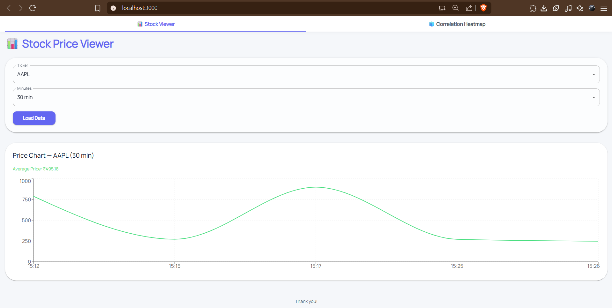
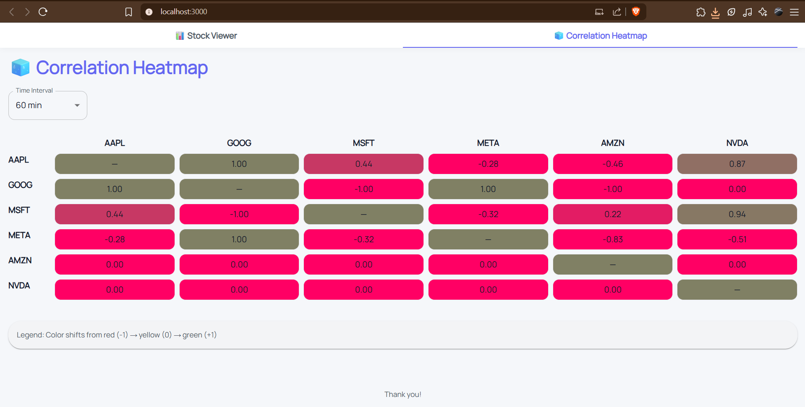

# PulseView – Stock Viewer & Correlation Heatmap

## Project Structure

- **Q1/** – Backend microservice  
- **Q2/** – Frontend React App  
  - **src/**  
  - **public/**  
  - **screenshots/**  
    - `2.1.png` – Stock Viewer screenshot  
    - `2.2.png` – Correlation Heatmap screenshot  

## Setup Instructions

### Backend (Q1)

1. Navigate to `Q1` folder:  
   ```bash
   cd Q1
   ```
2. Install dependencies and start server:  
   ```bash
   npm install
   npm start
   ```
3. Verify API endpoints:  
   - `GET http://localhost:3001/stocks/:ticker?minutes=m&aggregation=average`  
   - `GET http://localhost:3001/stockcorrelation?minutes=m&ticker=XYZ&ticker=ABC`  

### Frontend (Q2)

1. Navigate to `Q2` folder:  
   ```bash
   cd Q2
   ```
2. Install dependencies and start dev server:  
   ```bash
   npm install
   npm start
   ```
3. Visit `http://localhost:3000` in your browser.  
4. Place your screenshots in `Q2/screenshots/` as follows:  
   - `2.1.png` – Stock Viewer page  
   - `2.2.png` – Correlation Heatmap page  

## Screenshots

Below are placeholders for your screenshots. After adding images, they will render here:




