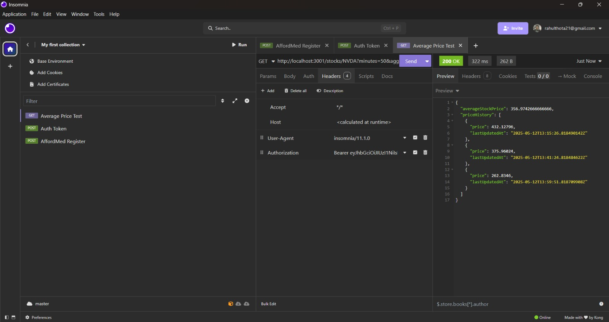
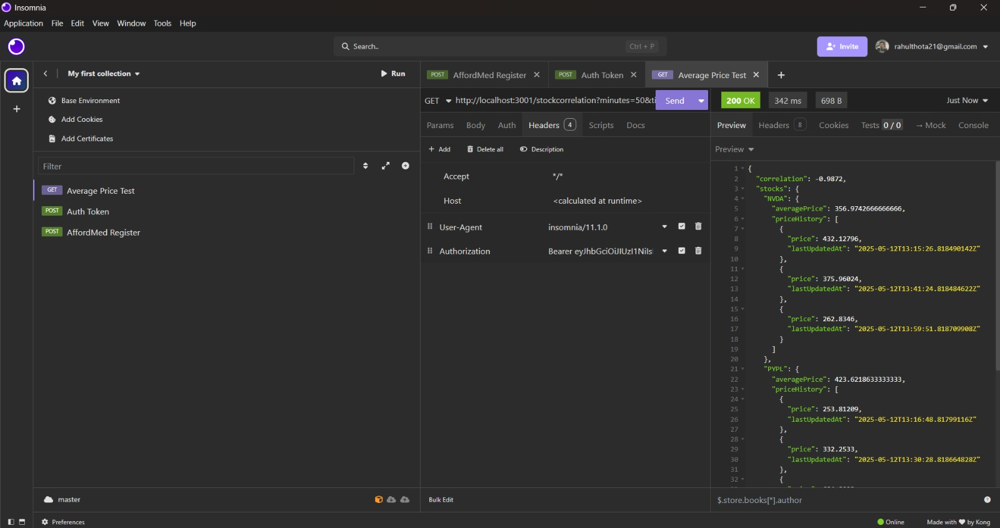

# Problem 1 – Backend Solution

This project implements two APIs using Node.js and Express for stock-related analytics.

## Implemented APIs

### 1. Average Stock Price

**Endpoint:**
```
GET /stocks/:ticker?minutes=50&aggregation=average
```

**Returns:**
- Average price of a given stock over the past `m` minutes
- Full price history during that interval

### 2. Correlation Between Two Stocks

**Endpoint:**
```
GET /stockcorrelation?minutes=50&ticker=STOCK1&ticker=STOCK2
```

**Returns:**
- Pearson correlation coefficient between two stocks
- Individual average prices and full price histories

## Tech Used

- Node.js
- Express.js
- Axios
- JavaScript (CommonJS)

## Usage

Place your `screenshots` folder inside this directory and include:

```md
### 📸 API 1 Output


### 📸 API 2 Output

```
